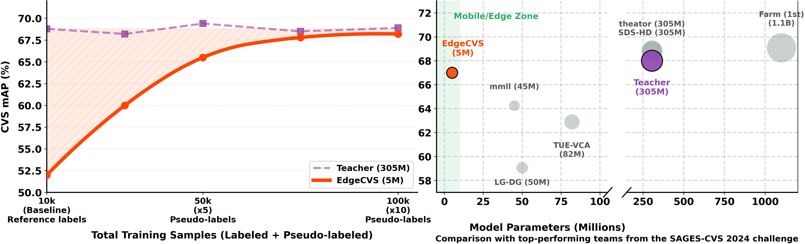

# EdgeCVS: Democratization of Surgical AI with a Distilled Edge-Deployable Critical View of Safety (CVS) Model

**MICCAI 2026** · Amine Yamlahi, Jakob Hennighausen, Pascal Hansen, David Leeb, Lena Maier-Hein


Division of Intelligent Medical Systems (IMSY), German Cancer Research Center (DKFZ), Heidelberg

[](https://papers.miccai.org/miccai-2026/paper/1745_paper.pdf)
[](https://imsy-dkfz.github.io/edgecvs/)
[](https://huggingface.co/IMSY-DKFZ/edgecvs)

> This release contains the inference code and the EdgeCVS-5M model weights. Training code coming soon.

EdgeCVS distills a 305M-parameter EVA02-Large teacher into a **5M-parameter EdgeNeXt-Small** student for
Critical View of Safety assessment in laparoscopic cholecystectomy. The teacher pseudo-labels 131K frames
taken only from the Calot-triangle-dissection phase. Trained on those frames, the student reaches
**66.5 mAP** on the SAGES-CVS 2024 test set (teacher: 66.9).

<p align="center">
  
</p>

## Installation

```bash
conda create -n edgecvs python=3.12
conda activate edgecvs
pip install -r requirements.txt
```

Video inference also needs [ffmpeg](https://ffmpeg.org) on the system for H.264 output.

## Inference

Run from the repository root. The model is downloaded from
[Hugging Face](https://huggingface.co/IMSY-DKFZ/edgecvs) on first use.

**Folder of images** (searched recursively): writes a CSV with `image_path` and the probabilities `C1`, `C2`, `C3`.

```bash
python cls/inference_folder.py input_dir=/path/to/images output_csv=predictions.csv
```

**Video**: writes `inference_videos/<name>_seg.mp4` (anatomy masks + CVS panel) and `<name>_plain.mp4` (CVS panel only).
`start`/`end` are optional (`mm:ss`, `hh:mm:ss` or seconds).

```bash
python cls/inference_video.py input_video=/path/to/video.mp4 start=01:10 end=01:25
```

Add `device=cpu` to run on the CPU.

## License

Code: [MIT](LICENSE.txt). Model weights: [CC BY-NC 4.0](https://creativecommons.org/licenses/by-nc/4.0/)
(trained on data released for non-commercial use).

## Citation

```bibtex
@InProceedings{YamAmi_EdgeCVS_MICCAI2026,
        author = { Yamlahi, Amine AND Hennighausen, Jakob AND Hansen, Pascal AND Leeb, David AND Maier-Hein, Lena},
        title = { { EdgeCVS: Democratization of surgical AI with a Distilled Edge-Deployable Critical View of Safety (CVS) model } },
        booktitle = {Medical Image Computing and Computer Assisted Intervention -- MICCAI 2026},
        year = {2026},
        publisher = {Springer Nature Switzerland},
        volume = {LNCS 16892},
        month = {September},
        page = {pending}
}
```
